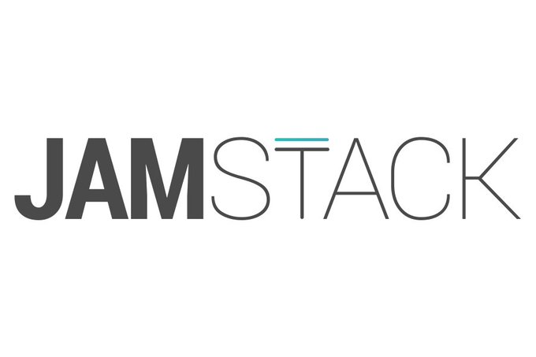

___

## Tabla de contenidos
* [TailwindCSS](#-tailwindcss)
* [Less options](#less-options)
* [Difference with ESLint](#difference-with-eslint)
* [Installation](#installation)
* [Prettier for beginners](#prettier-for-beginners)

___

El desarrollo de mi blog es algo que había estado deseando desde hace ya más de un año, y como con muchas ideas, había quedado engavetado hasta este mes de febrero del 2020.

En este mes mr contacto un cliente de Estados Unidos y me dijo quería que le ayudara con el desarrollo de una página web y eventualmente con un CRM (Eventualmente quizás escriba un poco sobre este proyecto), pero resulta que el desarrollo se debía hacer con herramientas como **React**, **Bulma**, entre otras. Pero para no hacer largo el cuento, fue este proyecto el que me dio el empujón adicional que necesitaba para iniciar con mi blog.

Para el desarrollo elegí una implementación del stack *JAM* (**Javascript**, **Api** y **Markdown**).

Ya hace varios meses había escuchado de esta tendencia y me había llamado la atención, antes de comenzar el desarrollo de mi blog ya había hecho un par de pruebas de esta stack pero usando NuxtJS.




Pero, ¿que es realmente el *JAM* stack? 

Lo siguiente lo podemos leer en [JAMSTACK.ORG](https://jamstack.org/) 

> "Fast and secure sites and apps delivered by pre-rendering files and serving them directly from a CDN, removing the requirement to manage or run web servers." 

Y pues eso es precisamente lo que me llamó la atención.

Puedo levantar un blog sin necesidad de gastar un cinco en recursos.

¿Como logré esto?, bueno pues usando las siguientes tecnologías

- React/NextJS
- TailwindCSS
- Markdown
- Netlify

### React/NextJS
Básicamente NextJS es React con esteroides, no profundizarse mucho en este tema, pero algo que beneficia mucho de esta tecnología es que se pueden construir.......

## TailwindCSS
Es un framework increíble....

### Markdown
.......

### Netlify
.......

Si alguien está interesado en ver como logre combinar todo para tener mi blog pueden acceder al repositorio
 *https://github.com/geabenitez/gersonaguirre.me*

Respecto a cómo publicar un sitio web estático en Netlify, pueden ver este recurso.....

Y pueden entrar a estas categorías para poder ver más sobre las tecnologías utilizadas.

```js
const handleImageUpload = event => {
  const files = event.target.files
  const formData = new FormData()
  formData.append('myFile', files[0])

  fetch('/saveImage', {
    method: 'POST',
    body: formData
  })
  .then(response => response.json())
  .then(data => {
    console.log(data)
  })
  .catch(error => {
    console.error(error)
  })
}
```

> *Si deseas contribuir a mejorar esta publicación puedes hacer un PR a [este repositorio](https://github.com/geabenitez/GersonAguirre.me)*